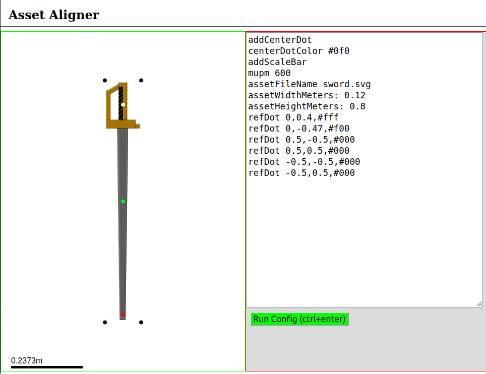

# Asset Alignment

A tool for mapping relative coordinates to an asset.

 - Uses `localStorage` (zombie cookies) to save last executed configuration.
 - Requires python3 to be installed on you system.
 - Do not expose the development server to the open internet.
 - If you resize your browser window you must refresh the page.
 - Tested on Firefox.


### Configuration Syntax

 - `assetFileName FILE_NAME` __required__. the image file name to draw
 - `mupm UNSIGNED_INTEGER` __required__. map units per meter. Pixels per meter with no scaling
 - `assetWidthMeters POSITIVE_FLOAT` __required__. the width of the asset in meters (no rotations)
 - `assetHeightMeters POSITIVE_FLOAT` __required__. the height of the asset in meters (no rotations)
 - `addCenterDot` places a dot in the center of the image
 - `centerDotColor HTML_COLOR_HEX` set the color of the center dot. Defaults to `#f00`
 - `addScaleBar` adds a map scale to the rendering
 - `refDot RELATIVE_X,RELATIVE_Y,HTML_COLOR_HEX` places a dot with a coordinate relative to the center of the unrotated asset center. You can add as many refDots as you please.


Example config
```
addCenterDot
centerDotColor #0f0
addScaleBar
mupm 600
assetFileName sword.svg
assetWidthMeters: 0.12
assetHeightMeters: 0.8
refDot 0,0.4,#fff
refDot 0,-0.47,#f00
refDot 0.5,-0.5,#000
refDot 0.5,0.5,#000
refDot -0.5,-0.5,#000
refDot -0.5,0.5,#000
```

 <hr>

App Screenshot


